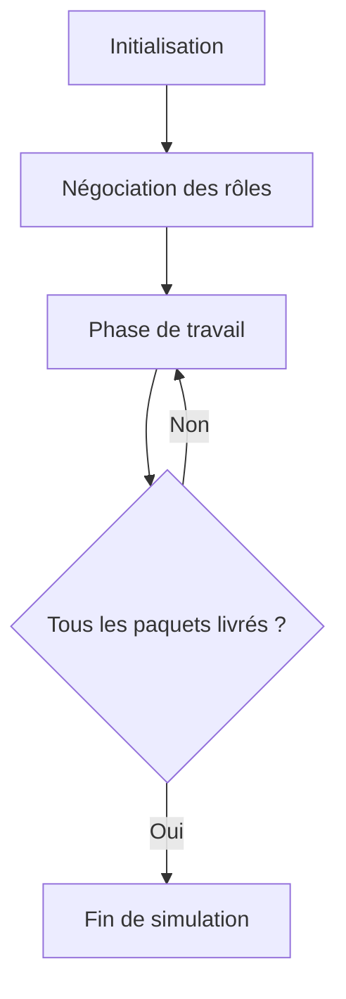
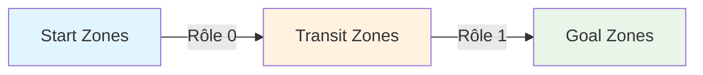
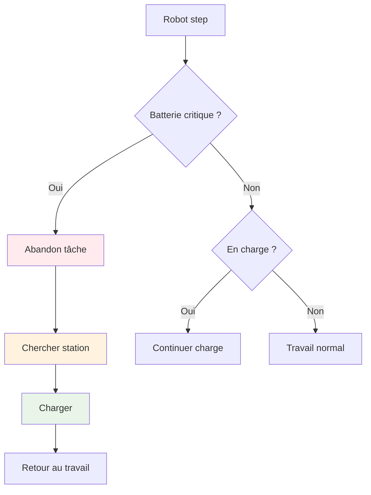

# Simulation de Robots Autonomes avec Gestion de Batterie

> **Un système intelligent de robots collaboratifs pour la logistique automatisée**

Ce projet présente une simulation avancée de robots autonomes dans un entrepôt, capable de gérer automatiquement le transport de paquets tout en optimisant l'utilisation de l'énergie. Le système se distingue par sa capacité d'auto-organisation et sa gestion intelligente des ressources.

## Pourquoi ce projet ?

Dans le monde réel, les entrepôts automatisés font face à des défis complexes :
- **Coordination** : Comment faire collaborer des dizaines de robots sans supervision centrale ?
- **Énergie** : Comment gérer l'autonomie limitée des robots ?
- **Efficacité** : Comment éviter les embouteillages et optimiser les flux ?

Notre simulation répond à ces défis avec des solutions innovantes et réalistes.

## Table des Matières
1. [Vue d'ensemble du projet](#vue-densemble-du-projet)
2. [Architecture du système](#architecture-du-système)
3. [Comment ça marche : Algorithme complet](#algorithme-de-simulation-complet)
4. [Négociation automatique des rôles](#système-de-négociation-des-rôles)
5. [Transport intelligent des paquets](#logique-de-transport-des-paquets)
6. [Gestion réaliste de la batterie](#système-de-gestion-de-batterie)
7. [Évitement intelligent des embouteillages](#gestion-de-lencombrement)
8. [Défis techniques et solutions](#problèmes-rencontrés-et-solutions)
9. [Limitations et améliorations futures](#limitations-actuelles)
10. [Installation et utilisation](#configuration-et-utilisation)

## Vue d'ensemble du projet

### Le concept en quelques mots

Imaginez un entrepôt Amazon où des robots autonomes travaillent 24h/24 pour traiter les commandes. Notre simulation reproduit ce scénario avec une twist : **les robots s'organisent eux-mêmes** sans chef d'orchestre central !

### Le scénario de simulation

**L'entrepôt virtuel :**
- **Taille** : Grille de 20×20 cases (400m² simulés)
- **Paquets** : Apparaissent dans 3 zones de départ (A1, A2, A3)
- **Destinations** : 2 zones de livraison finale (Z1, Z2)
- **Innovation** : Zones de transit intermédiaires pour optimiser les flux

**Les acteurs :**
- **Robots autonomes** : De 6 à 10 robots qui s'auto-organisent
- **Employés mobiles** : Obstacles humains qui se déplacent aléatoirement
- **Stations de charge** : 4 bornes de recharge stratégiquement placées

### Objectifs du système

1. **Transport efficace** : Livrer tous les paquets le plus rapidement possible
2. **Auto-organisation** : Les robots négocient leurs rôles sans intervention humaine
3. **Gestion énergétique** : Optimiser l'autonomie avec des contraintes de batterie réalistes
4. **Robustesse** : Fonctionner même avec des pannes ou des obstacles imprévus

### Innovations techniques majeures

#### Système de rôles dynamiques
**Avant** : Il fallait créer manuellement des robots de types différents
```java
// Ancienne approche rigide
MyRobot robot1 = new MyRobot();      // Transport start → transit
MyTransitRobot robot2 = new MyTransitRobot(); // Transport transit → goal
```

**Maintenant** : Tous les robots sont identiques et négocient leurs rôles
```java
// Nouvelle approche flexible
MyRobot robot = new MyRobot(); // S'adapte automatiquement selon les besoins
```

#### Gestion réaliste de l'énergie
- **Consommation** : Chaque mouvement coûte 1% de batterie
- **Autonomie** : 100 mouvements maximum avant recharge
- **Stations** : 4 bornes de recharge avec système de réservation
- **Priorité** : La survie énergétique prime sur les tâches de transport

#### Intelligence collective
- **Communication** : Les robots s'échangent des informations en temps réel
- **Coordination** : Évitement automatique des embouteillages
- **Adaptation** : Réaction dynamique aux changements d'environnement

## Architecture du système

### Organisation du code

Notre architecture suit le principe de **séparation des responsabilités** pour une maintenance facile :

```
Projet
├── simulator/
│   ├── MyRobot.java          # Cerveau des robots (logique principale)
│   ├── MySimFactory.java     # Usine de création de la simulation
│   ├── Worker.java           # Employés mobiles (obstacles dynamiques)
│   └── SimFactory.java       # Classe abstraite de base
│
├── parameters/
│   ├── configuration.ini     # Paramètres de simulation
│   └── environment.ini       # Layout de l'entrepôt
│
└── lib/                      # Bibliothèques externes
```

### Plan de l'entrepôt virtuel

Voici comment est organisé notre entrepôt de 20×20 cases :

```
    0   1   2   3   4   5   6   7   8   9  10  11  12  13  14  15  16  17  18  19
 0  .   .   .   .   .  Z1   .   .   .   .   .   .   .   .   .  Z2   .   .   .   .
 1  .   .   .   .   .   .   .   .   .   .   .   .   .   .   .   .   .   .   .   .
 2  .   . CHG  .   .   .   .   .   .   .   .   .   .   .   .   .   . CHG  .   .
 3  .   .   .   .   .   .   .   .   .   .   .   .   .   .   .   .   .   .   .   .
 ...
 9  .   .   .   .   .   .   .   .   .  T  .  T  .   .   .   .   .   .   .   .
10  .   .   .   .   .   .   .   .   .  T  .  T  .   .   .   .   .   .   .   .
...
17  .   . CHG  .   .   .   .   .   .   .   .   .   .   .   .   .   . CHG  .   .
18  .   .   .   .   .   .   .   .   .   .   .   .   .   .   .   .   .   .   .   .
19  .   .   .   .   .   . A1  .   . A2  .   . A3  .   .   .   .   .   .   .   .
```

**Légende :**
- CHG = Stations de charge (4 coins)
- A = Zones de départ (3 zones en bas)
- T = Zones de transit (4 zones au centre)
- Z = Zones de destination (2 zones en haut)

### Composants détaillés de l'environnement

#### Zones de départ (Start Zones)
**Rôle** : Points d'apparition des paquets à transporter
- **A1** : Position (6,19) - Zone de gauche
- **A2** : Position (9,19) - Zone centrale
- **A3** : Position (12,19) - Zone de droite
- **Particularité** : Les robots ne peuvent pas s'y arrêter (zones réservées)
- **Génération** : Nouveaux paquets toutes les 10 étapes de simulation

#### Zones de transit (Transit Zones)
**Rôle** : Points de relais pour optimiser les flux
- **Positions** : (12,10), (12,9), (9,10), (9,9)
- **Capacité** : 1 paquet maximum par zone
- **Innovation** : Permettent de découpler les deux phases de transport
- **Avantage** : Évitent que les robots rôle 0 et rôle 1 se gênent mutuellement

#### Zones de destination (Goal Zones)
**Rôle** : Points de livraison finale
- **Z1** : Position (5,0) - Destination ouest
- **Z2** : Position (15,0) - Destination est
- **Validation** : Comptabilisation automatique des livraisons réussies
- **Fin de simulation** : Quand tous les paquets sont livrés

#### Stations de chargement
**Rôle** : Points de recharge énergétique
- **Station 1** : (2,2) - Coin sud-ouest
- **Station 2** : (17,2) - Coin sud-est
- **Station 3** : (2,17) - Coin nord-ouest
- **Station 4** : (17,17) - Coin nord-est
- **Couleur** : Orange (255,165,0) pour identification visuelle
- **Fonctionnement** : Les robots se positionnent en cases adjacentes pour charger

#### Obstacles et contraintes
**Obstacles fixes** : Murs et équipements définis dans environment.ini
**Employés mobiles (Workers)** :
- Se déplacent aléatoirement dans l'entrepôt
- Représentent les humains travaillant dans l'entrepôt
- Créent des obstacles dynamiques que les robots doivent contourner

## Comment ça marche : Algorithme complet

### Vue d'ensemble du processus

Notre simulation suit un cycle de vie en 3 phases principales :



### Phase 1 : Initialisation de l'entrepôt

**Objectif** : Créer l'environnement de simulation complet

```java
// Construction de l'entrepôt virtuel étape par étape
sim.createEnvironment();        // Grille 20x20 vide
sim.createObstacle();          // Murs et obstacles fixes
sim.createGoal();              // Zones de destination Z1, Z2
sim.createStartZones();        // Zones de départ A1, A2, A3
sim.createTransitZones();      // Zones de transit (4 zones)
sim.createExitZones();         // Portes de sortie
sim.createChargingStations();  // 4 stations de charge
sim.createWorker();            // Employés mobiles
sim.createRobot();             // Robots (tous identiques au départ)
```

**Résultat** : Un entrepôt fonctionnel avec tous ses composants

### Phase 2 : Négociation automatique des rôles

**Problème à résoudre** : Comment répartir automatiquement les robots en deux équipes ?
- **Équipe A (Rôle 0)** : Transport des paquets start → transit
- **Équipe B (Rôle 1)** : Transport des paquets transit → goal

**Solution innovante** : Négociation décentralisée sans chef d'orchestre

```java
// Chaque robot démarre en mode négociation
public MyRobot(...) {
    this.etat = Etat.ROLE_NEGOTIATION;  // Mode négociation
    totalRobots++;                       // Comptage global
    this.negotiationStartTime = System.currentTimeMillis();

    // "Salut tout le monde, je suis Robot X !"
    broadcastMessage("ROBOT_ANNOUNCE:" + getName());
}
```

**Processus de négociation** (détaillé dans la section suivante)

### Phase 3 : Travail collaboratif

**Coordination centrale** : Le MySimFactory orchestre le tout

```java
// D'abord, laisser les robots négocier leurs rôles
while (!negotiationComplete && negotiationSteps < 10) {
    negotiationSteps++;
    boolean allRolesAssigned = true;

    for (Robot r : robots) {
        if (r instanceof MyRobot) {
            MyRobot myRobot = (MyRobot) r;
            if (!myRobot.isRoleNegotiationComplete()) {
                myRobot.step(); // Seulement la négociation
                allRolesAssigned = false;
            }
        }
    }

    if (allRolesAssigned) {
        negotiationComplete = true;
        System.out.println("Négociation terminée !");
    }
}

// Ensuite, démarrer le travail effectif
for (int i = 0; i < sp.step; i++) {
    // Génération de nouveaux paquets (toutes les 10 étapes)
    if (validGeneration()) {
        createPackages(currentNBPacket);
    }

    // Activation de tous les robots
    for (Robot r : robots) {
        r.updatePerception();           // Observer l'environnement
        ((MyRobot)r).step();           // Prendre des décisions
        updateEnvironment();           // Mettre à jour l'affichage
    }

    // Vérifier si tous les paquets sont livrés
    if (deliveredCount >= nbPackages) {
        System.out.println("Mission accomplie !");
        break;
    }
}
```

### Métriques de performance

À chaque simulation, le système mesure :
- **Temps total** : Nombre d'étapes pour livrer tous les paquets
- **Efficacité énergétique** : Nombre de recharges nécessaires
- **Coordination** : Nombre de conflits évités
- **Robustesse** : Capacité à gérer les obstacles imprévus

## Négociation automatique des rôles

### Le défi de la répartition automatique

**Problème** : Comment faire en sorte que 10 robots identiques se répartissent automatiquement en deux équipes équilibrées sans supervision humaine ?

**Solution** : Un protocole de négociation décentralisé inspiré des algorithmes de consensus distribués.

### Principe de fonctionnement

Imaginez 10 personnes dans une salle qui doivent se diviser en deux équipes sans chef d'équipe :

1. **Annonce** : Chacun dit son nom à voix haute
2. **Écoute** : Chacun note les noms entendus
3. **Calcul** : Chacun applique la même règle de répartition
4. **Attribution** : Chacun s'attribue un rôle selon la règle
5. **Confirmation** : Chacun annonce son rôle choisi

**Résultat** : Répartition équilibrée garantie sans coordination centrale !

### Algorithme détaillé en 3 étapes

#### Étape 0 : Découverte mutuelle (4×waittime)

**Objectif** : Chaque robot découvre combien ils sont au total

```java
// Chaque robot s'annonce
broadcastMessage("ROBOT_ANNOUNCE:" + getName());

// Écouter les annonces des autres pendant 4×waittime
if (System.currentTimeMillis() - negotiationStartTime > waittime * 4) {
    knownTotalRobots = totalRobots; // Maintenant je sais combien on est
    negotiationStep++; // Passer à l'étape suivante
}
```

**Exemple concret** :
- Robot0 : "Salut, je suis Robot0 !"
- Robot1 : "Salut, je suis Robot1 !"
- Robot2 : "Salut, je suis Robot2 !"
- ...
- Résultat : Tous savent qu'ils sont 10 robots au total

#### Étape 1 : Attribution par ordre lexicographique

**Règle simple** : Les robots avec les noms "plus petits" prennent le rôle 0

```java
// Compter combien de robots ont un nom "plus petit" que le mien
int robotsBeforeMe = 0;
for (int i = 0; i < totalRobots; i++) {
    String otherRobotName = "Robot" + i;
    if (otherRobotName.compareTo(getName()) < 0) {
        robotsBeforeMe++; // Ce robot a un nom plus petit
    }
}

// Attribution du rôle selon la position
int targetRole0Count = totalRobots / 2; // 50% en rôle 0
if (robotsBeforeMe < targetRole0Count) {
    assignedRole = 0; // Transport start → transit
    broadcastMessage("ROLE_ASSIGNED:0:" + getName());
} else {
    assignedRole = 1; // Transport transit → goal
    broadcastMessage("ROLE_ASSIGNED:1:" + getName());
}
```

**Exemple avec 10 robots** :
- Robot0, Robot1, Robot2, Robot3, Robot4 → Rôle 0 (start→transit)
- Robot5, Robot6, Robot7, Robot8, Robot9 → Rôle 1 (transit→goal)

#### Étape 2 : Finalisation (9×waittime)

**Objectif** : S'assurer que tout le monde a fini de négocier

```java
// Attendre que tout le monde ait terminé
if (System.currentTimeMillis() - negotiationStartTime > waittime * 9) {
    roleNegotiationComplete = true;
    etat = Etat.FREE; // Prêt à travailler !
    System.out.println(getName() + " commence le travail en tant que rôle " + assignedRole);
}
```

### Avantages de cette approche

#### **Déterminisme**
- Même résultat à chaque fois avec les mêmes robots
- Pas de hasard, pas de conflit possible

#### **Équilibrage automatique**
- Toujours 50/50 (ou proche si nombre impair)
- Adaptation automatique au nombre de robots

#### **Décentralisation**
- Pas de point de défaillance unique
- Chaque robot prend ses propres décisions

#### **Simplicité**
- Algorithme simple à comprendre et déboguer
- Temps de négociation prévisible et court

### Exemple concret avec 6 robots

| Robot | Position | Rôle attribué | Justification |
|-------|----------|---------------|---------------|
| Robot0 | 0 | Rôle 0 | 0 < 3 (50% de 6) |
| Robot1 | 1 | Rôle 0 | 1 < 3 |
| Robot2 | 2 | Rôle 0 | 2 < 3 |
| Robot3 | 3 | Rôle 1 | 3 ≥ 3 |
| Robot4 | 4 | Rôle 1 | 4 ≥ 3 |
| Robot5 | 5 | Rôle 1 | 5 ≥ 3 |

**Résultat** : 3 robots rôle 0, 3 robots rôle 1 → Parfaitement équilibré !

## Transport intelligent des paquets

### Les deux rôles complémentaires

Notre système utilise une approche en **pipeline à deux étages** pour optimiser les flux :



**Avantages de cette approche** :
- **Spécialisation** : Chaque robot maîtrise parfaitement sa partie
- **Parallélisation** : Les deux phases peuvent fonctionner simultanément
- **Optimisation** : Réduction des conflits et des temps d'attente

### Rôle 0 : Les collecteurs (Start → Transit)

**Mission** : Récupérer les paquets dans les zones de départ et les amener aux zones de transit

#### Machine à états du rôle 0

```java
private void stepRole0() {
    switch(etat) {
        case MOVING_AWAY:
            // S'éloigner des zones de transit après dépôt
            // Distance : 8 cases minimum pour éviter l'encombrement
            moveAwayFromTransitZones(true, 8.0, true);
            break;

        case FREE:
            // Mode recherche active
            // 1. Chercher zone de départ adjacente avec paquets
            // 2. Si trouvé : prendre paquet et chercher zone de transit libre
            // 3. Si pas de paquets : se positionner stratégiquement
            searchAndCollectPackages();
            break;

        case TRANSPORT:
            // Mode transport
            // Se diriger vers zone de transit et déposer le paquet
            deliverToTransitZone();
            break;
    }
}
```

#### Algorithme détaillé du rôle 0

**Étape 1 : Recherche de paquets**
```java
// Chercher une zone de départ adjacente avec des paquets
ColorStartZone adjacentStartZone = findAdjacentStartZone();
if (adjacentStartZone != null && !adjacentStartZone.getPackages().isEmpty()) {
    // Prendre le premier paquet disponible
    carriedPackage = adjacentStartZone.getPackages().get(0);
    adjacentStartZone.removePackage(carriedPackage);
    etat = Etat.TRANSPORT;
    System.out.println(getName() + " a pris le paquet " + carriedPackage.getId());
}
```

**Étape 2 : Transport vers transit**
```java
// Trouver la zone de transit la plus proche et libre
TransitZone bestTransitZone = findBestTransitZone();
if (bestTransitZone != null) {
    // Se diriger vers cette zone
    moveTowardsTransitZone(bestTransitZone);

    // Si adjacent, déposer le paquet
    if (isAdjacentTo(bestTransitZone)) {
        bestTransitZone.addPackage(carriedPackage);
        carriedPackage = null;
        etat = Etat.MOVING_AWAY; // S'éloigner pour éviter l'encombrement

        // Notifier les robots rôle 1
        notifyPackageInTransit(packageId, transitZoneX, transitZoneY);
    }
}
```

### Rôle 1 : Les livreurs (Transit → Goal)

**Mission** : Récupérer les paquets dans les zones de transit et les livrer aux destinations finales

#### Machine à états du rôle 1

```java
private void stepRole1() {
    switch(etat) {
        case MOVING_AWAY:
            // S'éloigner des zones de goal après livraison
            moveAwayFromGoalZones();
            break;

        case FREE:
            // Mode recherche active
            // 1. Chercher zone de transit avec paquets (priorité aux notifications)
            // 2. Si trouvé : prendre paquet et aller vers goal final
            // 3. Si pas de paquets : éviter encombrement des zones de transit
            searchAndCollectFromTransit();
            break;

        case TRANSPORT:
            // Mode livraison finale
            // Se diriger vers la destination finale et livrer
            deliverToFinalGoal();
            break;
    }
}
```

#### Algorithme détaillé du rôle 1

**Étape 1 : Écoute des notifications**
```java
// Traiter les notifications de paquets en transit
for (String notification : receivedRoleMessages) {
    if (notification.startsWith("PACKAGE_IN_TRANSIT:")) {
        String[] parts = notification.split(":");
        String packageId = parts[1];
        int transitX = Integer.parseInt(parts[2]);
        int transitY = Integer.parseInt(parts[3]);

        // Aller récupérer ce paquet en priorité
        targetTransitZone = new Position(transitX, transitY);
    }
}
```

**Étape 2 : Livraison finale**
```java
// Déterminer la destination finale selon le paquet
GoalZone finalDestination = determineGoalZone(carriedPackage);

// Se diriger vers la destination
moveTowardsGoal(finalDestination);

// Si adjacent, livrer le paquet
if (isAdjacentTo(finalDestination)) {
    finalDestination.addPackage(carriedPackage);
    MySimFactory.deliveredCount++; // Compteur global
    carriedPackage = null;
    etat = Etat.MOVING_AWAY; // S'éloigner pour éviter l'encombrement

    System.out.println("Paquet livré ! Total : " + MySimFactory.deliveredCount);
}
```

### Communication inter-robots

**Problème** : Comment les robots rôle 0 et rôle 1 se coordonnent-ils sans supervision centrale ?

**Solution** : Système de messagerie décentralisé en temps réel

#### Notification de dépôt en transit

Quand un robot rôle 0 dépose un paquet en transit, il prévient immédiatement tous les robots rôle 1 :

```java
// Notification automatique après dépôt
private void notifyPackageInTransit(String packageId, int transitZoneX, int transitZoneY) {
    // Créer le message structuré
    String notification = "PACKAGE_IN_TRANSIT:" + packageId + ":" +
                         transitZoneX + ":" + transitZoneY + ":" + getName();

    // Diffuser à tous les robots
    broadcastMessage(notification);

    // Log pour suivi
    System.out.println(getName() + " notifie: colis " + packageId +
                      " déposé en transit (" + transitZoneX + "," + transitZoneY + ")");
}
```

#### Système de diffusion

```java
// Diffusion de messages à tous les autres robots
private void broadcastMessage(String messageContent) {
    if (env != null && env.getRobot() != null) {
        // Parcourir tous les robots de l'environnement
        for (fr.emse.fayol.maqit.simulator.components.Robot robot : env.getRobot()) {
            // Envoyer seulement aux autres MyRobot (pas à soi-même)
            if (robot instanceof MyRobot && !robot.getName().equals(getName())) {
                ((MyRobot) robot).receiveMessage(messageContent);
            }
        }
    }
    System.out.println(getName() + " diffuse: " + messageContent);
}
```

#### Réception et traitement des messages

```java
// Recevoir un message d'un autre robot
private void receiveMessage(String messageContent) {
    receivedRoleMessages.add(messageContent);
    System.out.println(getName() + " reçoit: " + messageContent);
}

// Traitement intelligent des messages
private void processReceivedMessages() {
    for (String message : receivedRoleMessages) {
        String[] parts = message.split(":");
        String messageType = parts[0];

        switch (messageType) {
            case "ROBOT_ANNOUNCE":
                // Un nouveau robot s'annonce
                updateKnownRobotCount();
                break;

            case "ROLE_ASSIGNED":
                // Un robot annonce son rôle
                updateRoleDistribution(parts);
                break;

            case "PACKAGE_IN_TRANSIT":
                // Un paquet est disponible en transit
                if (assignedRole == 1) { // Seulement pour les robots rôle 1
                    prioritizeTransitZone(parts);
                }
                break;
        }
    }
}
```

### Flux de communication typique

**Exemple concret** : Robot0 (rôle 0) dépose un paquet en transit

1. **Robot0** : Dépose paquet P123 en zone transit (9,10)
2. **Robot0** : `broadcastMessage("PACKAGE_IN_TRANSIT:P123:9:10:Robot0")`
3. **Robot5** (rôle 1) : Reçoit le message et priorise cette zone
4. **Robot5** : Se dirige vers (9,10) pour récupérer P123
5. **Robot5** : Livre P123 à la destination finale

**Résultat** : Coordination efficace sans coordination centrale !

## Gestion réaliste de la batterie

### Pourquoi un système de batterie ?

Dans le monde réel, les robots ont une autonomie limitée. Notre simulation reproduit cette contrainte pour :
- **Réalisme** : Simuler les vrais défis de la robotique industrielle
- **Optimisation** : Forcer les robots à optimiser leurs déplacements
- **Robustesse** : Tester la capacité du système à gérer les pannes énergétiques

### Modèle énergétique

Notre modèle de batterie simule un robot industriel typique :

```java
// Paramètres énergétiques réalistes
protected int batteryLevel = 100;           // Niveau actuel (0-100%)
protected int maxBatteryLevel = 100;        // Capacité maximale
protected int batteryConsumptionPerMove = 1; // Consommation par mouvement (1%/case)
protected int lowBatteryThreshold = 20;     // Seuil critique (20%)
protected boolean isCharging = false;       // État de charge
protected int chargingRate = 5;             // Vitesse de charge (5%/step)
protected String reservedChargingStation = null; // Station réservée
```

**Autonomie** : 100 mouvements maximum avant recharge obligatoire
**Temps de charge** : 20 étapes pour une charge complète (100% ÷ 5%/step)

### États énergétiques

Le robot peut être dans différents états liés à l'énergie :

```java
enum Etat {
    // États de travail normal
    FREE,               // Libre, cherche du travail
    TRANSPORT,          // Transporte un paquet
    MOVING_AWAY,        // S'éloigne pour éviter l'encombrement

    // États énergétiques (priorité absolue)
    GOING_TO_CHARGE,    // Recherche une station de charge
    CHARGING,           // En cours de chargement
}
```

### Hiérarchie des priorités énergétiques

**Principe fondamental** : La survie énergétique prime sur tout le reste !



### Logique de priorité dans step()
```java
public void step() {
    // PRIORITÉ 1: Négociation des rôles
    if (etat == Etat.ROLE_NEGOTIATION) {
        negotiateRole();
        return;
    }

    // PRIORITÉ 2: Gestion de la batterie
    if (etat == Etat.CHARGING) {
        handleChargingLogic();
        return;
    }

    if (etat == Etat.GOING_TO_CHARGE) {
        goToChargingStation();
        return;
    }

    // PRIORITÉ 3: Vérification batterie critique
    if (needsCharging()) {
        // Abandonner tâche actuelle
        if (carriedPackage != null) {
            carriedPackage = null; // Abandon du paquet
        }
        etat = Etat.GOING_TO_CHARGE;
        return;
    }

    // PRIORITÉ 4: Travail normal
    if (assignedRole == 0) stepRole0();
    else if (assignedRole == 1) stepRole1();
}
```

### Gestion préventive de la batterie
```java
// Dans stepRole0() et stepRole1()
if (etat == Etat.FREE) {
    // Vérifier d'abord si on a assez de batterie pour prendre un colis
    if (!hasSufficientBatteryForTask()) {
        System.out.println(getName() + " - Batterie insuffisante (" + batteryLevel + "%), va se charger");
        etat = Etat.GOING_TO_CHARGE;
        return;
    }
    // ... reste de la logique de prise de colis
}

protected boolean hasSufficientBatteryForTask() {
    return batteryLevel >= minBatteryForTask; // 60%
}
```
```

### Consommation de batterie
```java
@Override
public boolean moveForward() {
    boolean result = super.moveForward();
    if (result) {
        consumeBattery(); // Consommation uniquement si mouvement réussi
    }
    return result;
}

protected void consumeBattery() {
    batteryLevel -= batteryConsumptionPerMove;

    // Affichage tous les 10% et quand critique
    int currentDisplayLevel = (batteryLevel / 10) * 10;
    if (currentDisplayLevel != lastBatteryDisplayLevel ||
        batteryLevel <= lowBatteryThreshold) {
        System.out.println(getName() + " - Niveau de batterie: " + batteryLevel + "%");
    }
}
```

### Algorithme de chargement
```java
protected void handleChargingLogic() {
    if (isCharging) {
        batteryLevel += chargingRate; // +5% par step

        if (batteryLevel >= maxBatteryLevel) {
            batteryLevel = maxBatteryLevel;
            isCharging = false;
            etat = Etat.FREE;
            reservedChargingStation = null;
            System.out.println(getName() + " - Chargement terminé, retour au travail (100%)");
        }
    }
}
```

### Recherche de station de charge
```java
protected String findNearestChargingStation() {
    String nearestStation = null;
    double minDistance = Double.MAX_VALUE;

    Map<String, int[]> chargingStations = new HashMap<>();
    chargingStations.put("station1", new int[]{2, 2});
    chargingStations.put("station2", new int[]{17, 2});
    chargingStations.put("station3", new int[]{2, 17});
    chargingStations.put("station4", new int[]{17, 17});

    for (Map.Entry<String, int[]> entry : chargingStations.entrySet()) {
        if (isChargingStationFree(stationName)) {
            double distance = distanceTo(this.getX(), this.getY(), pos[0], pos[1]);
            if (distance < minDistance) {
                minDistance = distance;
                nearestStation = stationName;
            }
        }
    }
    return nearestStation;
}
```

### Réservation de stations
- **Système de réservation** : Évite que plusieurs robots aillent à la même station
- **Vérification de disponibilité** : Contrôle si une station est déjà réservée
- **Libération automatique** : La réservation est libérée après chargement complet

## Gestion de l'encombrement

### Problème identifié
Les robots avaient tendance à se regrouper dans les mêmes zones, créant des embouteillages et réduisant l'efficacité globale.

### Solution : Système moveAway unifié

#### Architecture des méthodes moveAway
```java
// Méthode générique (fait le vrai travail)
private void moveAwayFromZones(int[][] avoidZones, double minDistance,
                              int[][] targetZones, boolean changeStateWhenFar,
                              String successMessage)

// Méthodes spécialisées (wrappers)
private void moveAwayFromTransitZones(boolean targetStartZones, double minDistance,
                                     boolean changeStateWhenFar)
private void moveAwayFromStartZones()
private void moveAwayFromGoalZones()
```

#### Algorithme de la méthode générique
```java
private void moveAwayFromZones(int[][] avoidZones, double minDistance, int[][] targetZones,
                              boolean changeStateWhenFar, String successMessage) {
    // 1. Vérifier distance actuelle aux zones à éviter
    double minDistToAvoid = calculateMinDistance(avoidZones);

    // 2. Si assez loin, retourner au travail
    if (minDistToAvoid >= minDistance) {
        if (changeStateWhenFar) {
            etat = Etat.FREE;
        }
        return;
    }

    // 3. Chercher meilleure position
    int bestX = this.getX();
    int bestY = this.getY();
    double bestScore = -Double.MAX_VALUE;

    for (positions dans rayon de recherche) {
        if (!isCellFree(x, y)) continue;

        // Calculer distance aux zones à éviter
        double distToAvoid = calculateMinDistance(avoidZones, x, y);
        double score = distToAvoid;

        // Si zones cibles définies, privilégier proximité
        if (targetZones != null) {
            if (distToAvoid < minDistance) continue; // Respecter distance minimale
            double distToTarget = calculateMinDistance(targetZones, x, y);
            score = distToAvoid - distToTarget; // Équilibrer éloignement/rapprochement
        }

        if (score > bestScore) {
            bestScore = score;
            bestX = x;
            bestY = y;
        }
    }

    // 4. Se déplacer vers meilleure position
    if (bestPosition found) {
        moveOneStepTo(bestX, bestY);
    }
}
```

#### Utilisation contextuelle
```java
// Rôle 0 après dépôt : s'éloigner des transit vers start
moveAwayFromTransitZones(true, 8.0, true);

// Rôle 1 en attente : juste s'éloigner des transit
moveAwayFromTransitZones(false, 4.0, false);

// Éviter encombrement des zones de départ
moveAwayFromStartZones();

// Rôle 1 après livraison : s'éloigner des goals
moveAwayFromGoalZones();
```

### Stratégies anti-encombrement

#### Sélection intelligente des zones de départ
```java
private ColorStartZone findClosestStartZone() {
    // Calcul du score combiné : distance + encombrement
    for (zone de départ) {
        int robotsNearby = countRobotsInRadius(zone, 3.0);
        double distance = distanceTo(zone);
        double score = distance + (robotsNearby * 5.0); // Pénaliser encombrement

        if (score < bestScore) {
            bestZone = zone;
        }
    }
}
```

#### Distances de sécurité
- **Transit zones** : 8 cases pour retour au travail, 4 cases pour évitement simple
- **Start zones** : 2 cases pour évitement temporaire
- **Goal zones** : 2 cases après livraison

#### Rayon de recherche adaptatif
```java
int searchRadius = targetZones != null ? 3 : 2;
```
- **Rayon 3** : Quand on a des zones cibles (recherche plus large)
- **Rayon 2** : Pour évitement simple (recherche locale)

## Problèmes rencontrés et solutions

### 1. Problème d'encombrement initial
**Problème** : Les robots se regroupaient tous dans les mêmes zones, créant des blocages.

**Solution** :
- Création du système `moveAway` unifié
- Algorithmes de dispersion intelligents
- Prise en compte de l'encombrement dans la sélection des zones

### 2. Problème de waittime
**Problème** : Les timeouts hardcodés ne s'adaptaient pas à la vitesse de simulation.

**Solution** :
```java
// Adaptation des timeouts au waittime
protected int waittime; // Référence au waittime de configuration

// Dans les timeouts
Thread.sleep(waittime * facteur_adaptation);
```

### 3. Duplication de code dans moveAway
**Problème** : 6 méthodes différentes avec logique similaire (186 lignes).

**Solution** :
- Refactorisation vers 1 méthode générique + 3 wrappers (98 lignes)
- Réduction de 47% du code
- Maintenance simplifiée

### 4. Gestion des rôles complexe
**Problème** : Nécessité de créer manuellement MyTransitRobot et MyRobot.

**Solution** :
- Suppression de MyTransitRobot
- Négociation automatique des rôles
- Tous les robots sont identiques au départ

### 5. Abandon de tâches lors de batterie faible
**Problème** : Que faire du paquet transporté quand la batterie devient critique ?

**Solution** :
```java
if (needsCharging() && carriedPackage != null) {
    System.out.println(getName() + " - Batterie critique! Abandon de la tâche actuelle");
    carriedPackage = null; // Abandon simple
    etat = Etat.GOING_TO_CHARGE;
}
```

### 6. Conflits d'accès aux stations de charge
**Problème** : Plusieurs robots tentent d'utiliser la même station.

**Solution** :
- Système de réservation avec `reservedChargingStation`
- Vérification de disponibilité avant réservation
- Libération automatique après chargement

## Limitations actuelles

### 1. Limitation principale : Waittime minimal
**Problème** : Le système tourne en rond avec des waittimes trop petits et beaucoup de paquets.

**Exemple** :
- 40 paquets : waittime minimal = 28ms
- En dessous : les robots n'arrivent pas à se coordonner efficacement

**Causes** :
- Les algorithmes de dispersion prennent du temps
- La négociation des rôles nécessite plusieurs cycles
- Les mouvements d'évitement créent des patterns cycliques

### 2. Abandon simple des paquets
**Limitation** : Quand un robot abandonne un paquet pour aller charger, le paquet disparaît.

**Impact** : Perte potentielle de paquets dans le système.

**Amélioration possible** : Remettre le paquet dans sa zone de départ.

### 3. Stations de charge fixes
**Limitation** : Positions hardcodées des stations de charge.

**Impact** : Pas de flexibilité pour différents environnements.

**Amélioration possible** : Lecture depuis environment.ini.

### 4. Algorithme de pathfinding simple
**Limitation** : `moveOneStepTo()` utilise un algorithme glouton simple.

**Impact** : Peut créer des chemins sous-optimaux.

**Amélioration possible** : Implémentation A* ou Dijkstra.

### 5. Gestion préventive de la batterie implémentée
**Amélioration** : Les robots vérifient maintenant qu'ils ont au moins 60% de batterie avant de prendre un colis.

**Bénéfices** :
- Réduction drastique des abandons de tâches
- Meilleure planification énergétique
- Évite la perte de colis due à une batterie critique

**Implémentation** :
```java
protected int minBatteryForTask = 60; // Seuil minimum pour prendre un colis (60%)

protected boolean hasSufficientBatteryForTask() {
    return batteryLevel >= minBatteryForTask;
}
```

### 6. Communication limitée
**Limitation** : Communication basique via variables statiques.

**Impact** : Pas de coordination avancée entre robots.

**Amélioration possible** : Système de messages plus sophistiqué.

### 7. Connaissance centralisée du nombre total de robots
**Limitation** : Chaque robot connaît d'entrée de jeu le nombre total de robots via la variable statique `totalRobots`.

**Impact** : Seul aspect encore centralisé du système, ce qui constitue une simplification par rapport à un système entièrement décentralisé.

**Justification** : Cette simplification nous a permis de grandement simplifier le code de négociation des rôles. Nous considérons qu'elle est négligeable si on suppose qu'en général les entrepôts changent rarement leur nombre de robots total et que donc l'indiquer à tous les robots peut être négligé pour décentraliser le système.

**Amélioration possible** : Implémentation d'un algorithme de découverte dynamique du nombre de robots (par exemple, timeout après lequel chaque robot assume que tous les robots se sont annoncés).

### 8. Gestion des Workers basique
**Limitation** : Les employés se déplacent aléatoirement.

**Impact** : Obstacles imprévisibles pour les robots.

**Amélioration possible** : Patterns de mouvement plus réalistes.

## Configuration et utilisation

### Fichiers de configuration

#### parameters/configuration.ini
```ini
[simulation]
step = 1000
waittime = 50
nbrobot = 10
# ... autres paramètres
```

#### parameters/environment.ini
```ini
[obstacles]
obstacle1 = 9,1
# ... autres obstacles

[startZones]
A1 = 6,19
A2 = 9,19
A3 = 12,19

[transitZones]
zone1 = 12,10,1
# ... autres zones

[chargingStations]
station1 = 2,2
station2 = 17,2
station3 = 2,17
station4 = 17,17
```

### Compilation et exécution
```bash
# Compilation
cd simulator
javac -cp "../lib/*" *.java

# Exécution
java -cp "../lib/*:." MySimFactory
```

### Paramètres recommandés
- **Waittime** : Minimum 30ms pour 10 paquets, 50ms+ pour 40+ paquets
- **Nombre de robots** : 6-10 pour équilibrer efficacité et encombrement
- **Nombre de paquets** : 10-20 pour tests, jusqu'à 40 pour stress test

### Métriques de performance
- **Temps total** : Affiché à la fin de simulation
- **Paquets livrés** : Compteur `MySimFactory.deliveredCount`
- **Niveau de batterie** : Affiché tous les 10% et quand critique

## Conclusion

Ce projet démontre un système complexe de robots autonomes avec :
- **Négociation automatique des rôles**
- **Gestion complète de batterie**
- **Algorithmes anti-encombrement sophistiqués**
- **Architecture modulaire et maintenable**

Les principales innovations sont la suppression du besoin de définir manuellement les types de robots et l'introduction d'un système de batterie réaliste qui influence directement le comportement des robots.

Le système est fonctionnel mais présente des limitations en termes de performance avec des paramètres extrêmes, ouvrant la voie à de futures améliorations en termes d'algorithmes de pathfinding et de coordination inter-robots.
